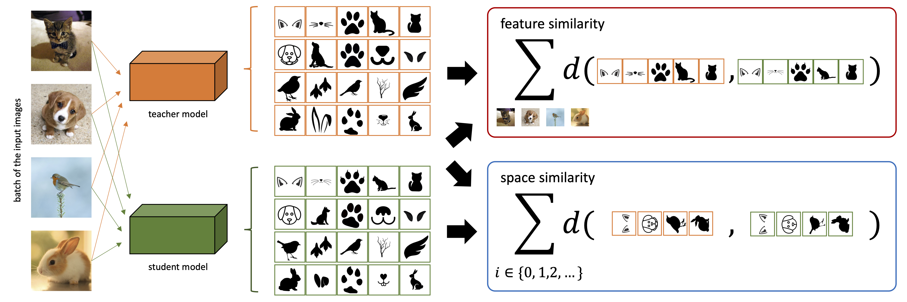
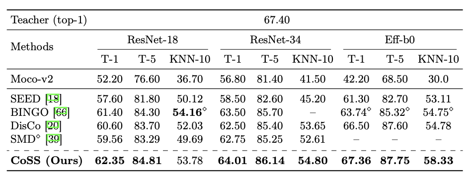

# Simple Unsupervised Knowledge Distillation With Space Similarity

This repository contains the implementation of the paper "Simple Unsupervised Knowledge Distillation With Space Similarity" presented at ECCV 2024.


## Abstract

As per recent studies, Self-supervised learning (SSL) does not readily extend to smaller architectures. One direction to mitigate this shortcoming while simultaneously training a smaller network without labels is to adopt unsupervised knowledge distillation (UKD). Existing UKD approaches handcraft preservation worthy inter/intra sample relationships between the teacher and its student. However, this may overlook/ignore other key relationships present in the mapping of a teacher. In this paper, instead of heuristically constructing preservation worthy relationships between samples, we directly motivate the student to model the teacher's embedding manifold. If the mapped manifold is similar, all inter/intra sample relationships are indirectly conserved. We first demonstrate that prior methods cannot preserve teacher's latent manifold due to their sole reliance on $L_2$ normalised embedding features. Subsequently, we propose a simple objective to capture the lost information due to normalisation. Our proposed loss component, termed **space similarity**, motivates each dimension of a student's feature space to be similar to the corresponding dimension of its teacher. We perform extensive experiments demonstrating strong performance of our proposed approach on various benchmarks.

## Method Overview



## Experimental Results

### Table of Results



### Download

| Teacher             | Student   | Top-1 | Download |
|---------------------|-----------|-------|----------|
| ResNet-50 (moco-v2) | ResNet-18 | 62.35 | [download](https://drive.google.com/file/d/1tDbPc1IAJtWPw_1gJ3OPvgxVCe6wWWMX/view?usp=share_link)         |
| ResNet-50 (moco-v2) | ResNet-34 | 64.01 | [download](https://drive.google.com/file/d/1wLhE-eWeWnBUxqxMGp9iOO_6QCtudKf8/view?usp=share_link)         |
| ResNet-50 (moco-v2) | Eff-b0    | 67.36 | [download](https://drive.google.com/file/d/1NIyDqYjfnriqM7cPdD0QjQtdtr9_A056/view?usp=share_link)         |
| ResNet-101(moco-v2) | ResNet-18 | 63.40 | [download](https://drive.google.com/file/d/10ClZTPlsu60vh9h3YN0ygPViMGTDRT-7/view?usp=share_link)         |
| ResNet-50 (moco-v3) | ResNet-18 | 67.20 | [download](https://drive.google.com/file/d/1tDbPc1IAJtWPw_1gJ3OPvgxVCe6wWWMX/view?usp=share_link)         |

## Preparation and Running the Method

### Requirements

- Python 3.x
- PyTorch
- NumPy
- Other dependencies listed in `requirements.txt`

### Installation

1. Clone the repository:

```bash
git clone https://github.com/paganpasta/coss-pytorch.git
cd coss-pytorch
```

Install the required packages:

 ```bash
 pip install -r requirements.txt
 ```

2. Data Preparation

Prepare your dataset as required. Ensure that the data is in the correct format and path.
```
root/
└── dataset/
    └── imagenet/
        ├── train
        └── val
```

### Offline K-NN

See the `compute_knn.sh` script for detailed arguments.

```bash
sh scripts/compute_knn.sh
```

### Distillation
See the `scripts/cf_train.sh` for replicating various results on ImageNet.

```bash
sh scripts/cf_train.sh
```

## Acknowledgement

The implementation borrows heavily from [SEED](https://github.com/jacobswan1/SEED).

## Citation

If you find this work useful, please cite our paper:

  ```bibtex
  @inproceedings{kd_coss_2024,
  title     = {Simple Unsupervised Knowledge Distillation With Space Similarity},
  author    = {Aditya Singh and Haohan Wang},
  booktitle = {Proceedings of the European Conference on Computer Vision (ECCV)},
  year      = {2024},
  }
  ```


## Contact

For any questions please raise an issue!
